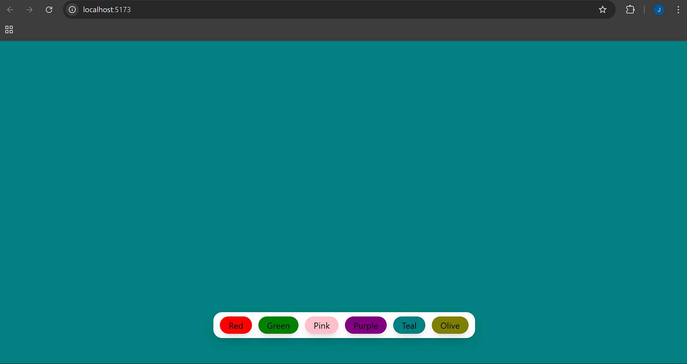

# ColorChanger

A simple React app to practice useState and event handling. It changes the background color of the page when a button is clicked.

---

##  Features

- Change background color with a button click
- Built using React functional components and hooks (`useState`)

---

## 📸 Screenshot

 <!-- Optional: Add a screenshot image if available -->

---

## Technologies Used

- React (with Vite)
- JavaScript (ES6+)
- TailwindCSS

---

##  Installation

1. **Clone the repo:**
   ```bash
   git clone https://github.com/sntripathi180/ColorChanger.git
   
   cd color-bg-changer
